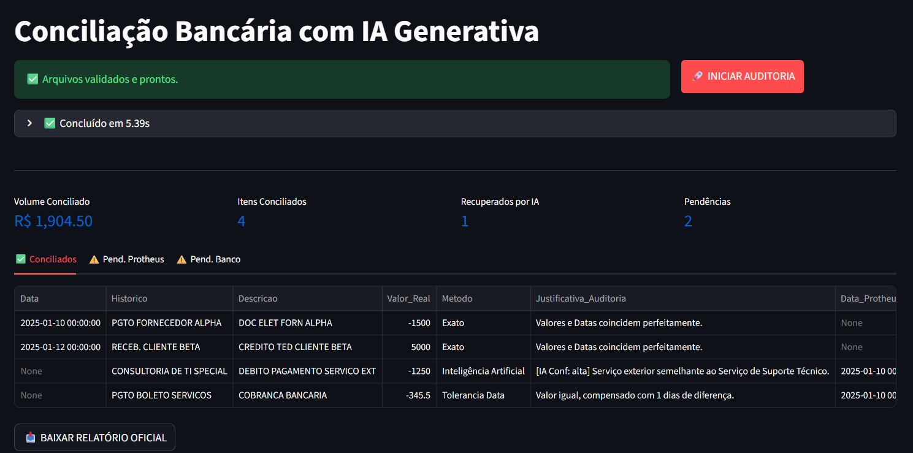

# 🛡️ Conciliador Enterprise AI: Auditoria Financeira Inteligente


> **Auditoria de Alta Precisão:** Uma arquitetura de engenharia para eliminar o gargalo da reconciliação bancária, unindo lógica determinística e IA Generativa Local.

---

## 🎯 O Problema de Negócio

No ambiente financeiro corporativo, a **conciliação bancária** (o cruzamento entre ERP e Banco) é um ponto crítico de falha:

1.  **Ineficiência Operacional:** Analistas seniores perdem horas no Excel procurando diferenças de centavos ou validando milhares de linhas.
2.  **Cegueira Semântica:** Softwares tradicionais falham em conectar *"PGTO FORNECEDOR ABC"* com *"TED J. SILVA LTDA"*. Eles enxergam texto, não contexto.
3.  **Risco de Privacidade:** Enviar dados financeiros para IAs públicas (Sem assinatura paga) viola normas de compliance e segurança bancária.

---

## 💡 A Solução: Auditor Digital Autônomo

O **Conciliador Enterprise AI** é um sistema que opera **localmente (Edge AI)** na infraestrutura da empresa. Ele não apenas compara números, ele "entende" transações.

### Diferenciais Estratégicos (ROI):
* 📉 **Velocidade:** Processa milhares de transações em segundos.
* 🔒 **Privacidade Total (LGPD):** Seus dados financeiros *nunca* saem da máquina. Nenhuma API externa é chamada.
* 🧠 **Inteligência Cognitiva:** Resolve divergências de descrição usando um LLM (Llama 3.2) treinado para entender contextos financeiros.
* 🛡️ **Compliance:** Logs auditáveis de todas as decisões tomadas pela IA.

---

## ⚙️ Arquitetura Lógica (O Funil de Auditoria)

O sistema aplica uma abordagem de **3 camadas** para garantir precisão máxima e custo computacional mínimo:

```mermaid
graph TD
    Input[📂 Arquivos: Banco + ERP] --> L1{Camada 1: <br>Match Exato}
    L1 -- Sim --> Conciliado[✅ Conciliado]
    L1 -- Não --> L2{Camada 2: <br>Match Temporal}
    
    L2 -- Sim (D+1/D-1) --> Conciliado
    L2 -- Não --> L3{Camada 3: <br>Agente IA (Llama 3.2)}
    
    L3 -- Alta Confiança --> Conciliado
    L3 -- Baixa Confiança --> Humano[⚠️ Revisão Humana]
    
    Conciliado --> Output[📊 Relatório Excel + Dashboard]
    Humano --> Output
    
    style L3 fill:#f9f,stroke:#333,stroke-width:2px

```
1. **Camada 1 (Match Exato):** Cruza Valor e Data idênticos. Liquida 80% do volume instantaneamente.
2. **Camada 2 (Lógica Fuzzy):** Identifica valores idênticos com datas próximas (ex: compensação em D+1).
3. **Camada 3 (IA Generativa):** O Agente de IA analisa as "sobras". Ele lê a descrição do extrato como um humano faria.
* *Exemplo:* Entende que *"PGTO SERVIÇOS T.I."* e *"DEBITO NF 4432 TECH"* são a mesma coisa.
* *Configuração:* Temperatura 0.0 (Determinística) para evitar alucinações.
---

## 🖥️ Interface do Usuário

**

A interface foi desenhada para o **Analista Financeiro**, abstraindo a complexidade do código:

* **Upload Drag-and-Drop** com validação de integridade.
* **Monitoramento em Tempo Real** do processamento.
* **Relatório Final Inteligente:** Abas separadas para Conciliados e Pendências, incluindo uma coluna com a **Justificativa da IA**.

---

## 🛠️ Tech Stack

Solução construída com foco em performance e segurança de dados:

* **Linguagem:** Python 3.10+
* **Frontend:** Streamlit (UX Focada em dados e travas de segurança).
* **Engenharia de Dados:** Pandas (ETL robusto e validação de schema).
* **GenAI / LLM:** Ollama + Llama 3.2 (3B) rodando via API REST local.

---

## 🚀 Como Executar

### Pré-requisitos

1. **Ollama** instalado ([ollama.com](https://ollama.com)).
2. Modelo baixado: `ollama pull llama3.2`

### Instalação

```bash
git clone [https://github.com/Dias500/conciliador-enterprise.git](https://github.com/Dias500/conciliador-enterprise.git)
pip install -r requirements.txt
streamlit run app.py

```

---

### 📬 Contato & Conexão

Projeto desenvolvido por **[Alan Chagas]**.
Focado em: Análise de Sistemas | Automação de Negócios | Inteligência Artificial Aplicada.

[https://www.linkedin.com/in/alan-dias-chagas/]